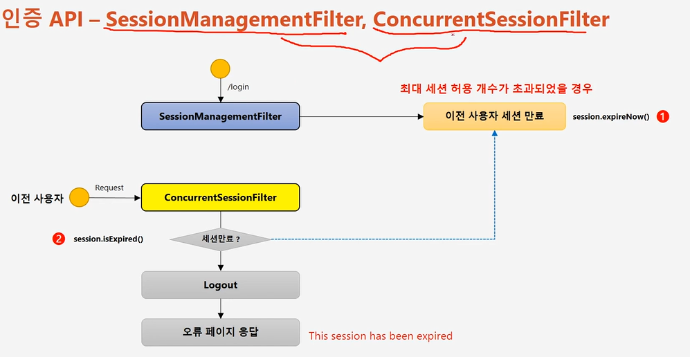
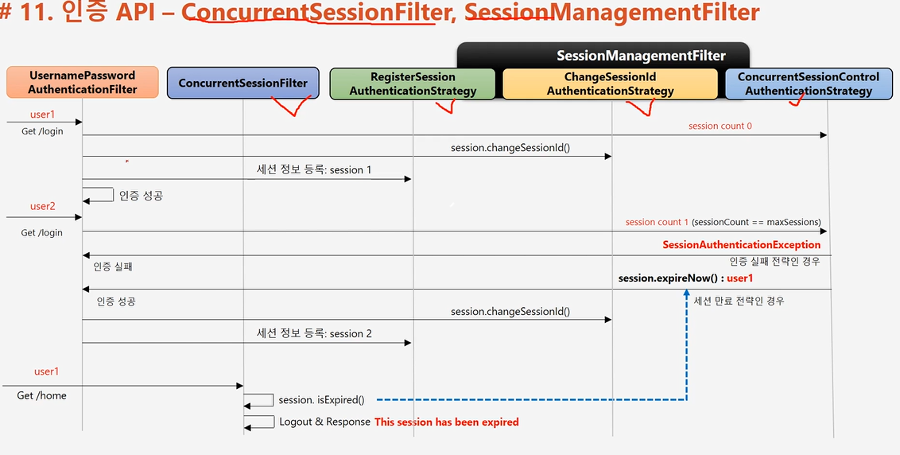

# SessionManagementFilter ,ConcurrentSessionFilter

1. 세션관리
    - 인증 시 사용자의 세션정보를 등록,조회,삭제 등의 세션 이력을 관리
    
2. 동시적 세션 제어
    - 동일 계정으로 접속이 허용되는 최대 세션수를 제한
    
3. 세션 고정 보호
    - 인증 할 때 마다 세션쿠키를새로 발급하여 공격자의 쿠키 조작을 방지
    
4. 세션 생성 정책
    - Always , If_Required, Never , Stateless
    
ConcurrentSessionFilter

-  매 요청 마다 현재 사용자의 세션 만료 여부 체크
- 세션이 만료되었을 경우 즉시 만료 처리

- Session.isExpired() == true
    - 로그아웃 처리
    - 즉시 오류 페이지 응답
    "This session has been expired"
      

- UsernamePasswordAuthenticationFilter
- ConcurrentSessionFilter
- RegisterSessionAuthenticationStrategy
- ChangeSessionIdAuthenticationStrategy
- ConcurrentSessionControlAuthenticationStrategy

