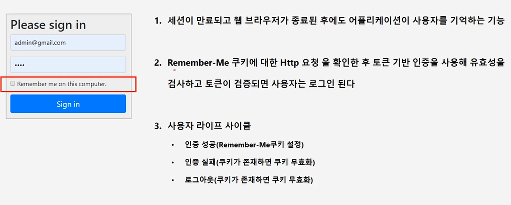
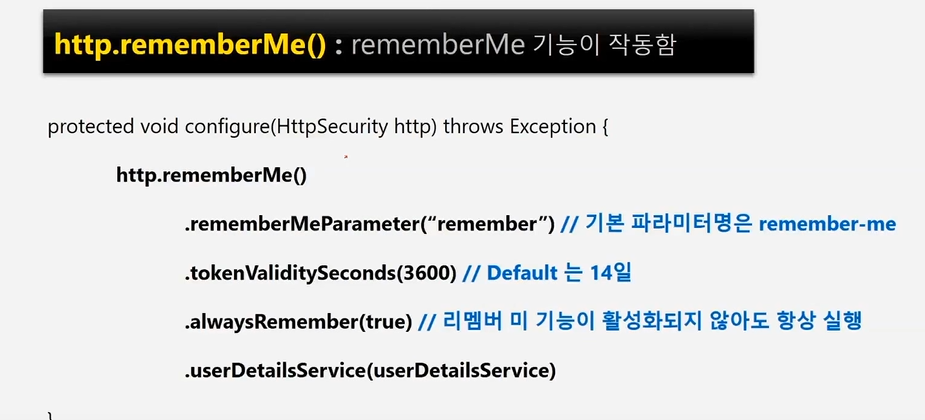

# Remember Me 인증

- 세션이 만료되고 웹 브라우저가 종료된 후에도 어플리케이션이 사용자를 기억하는 기능
- Remember-Me 쿠키에 대한 Http 요청을 확인한 후 토큰 기반 인증을 사용해 유효성을 검사하고
토큰이 검증되면 사용자는 로그인 된다.
  
- 사용자 라이프 사이클
    - 인증 성공 (Remember-Me 쿠키 설정)
    - 인증 실패(쿠키가 존재하면 쿠키 무효화)
    - 로그아웃(쿠키가 존재하면 쿠키 무효화)
    

