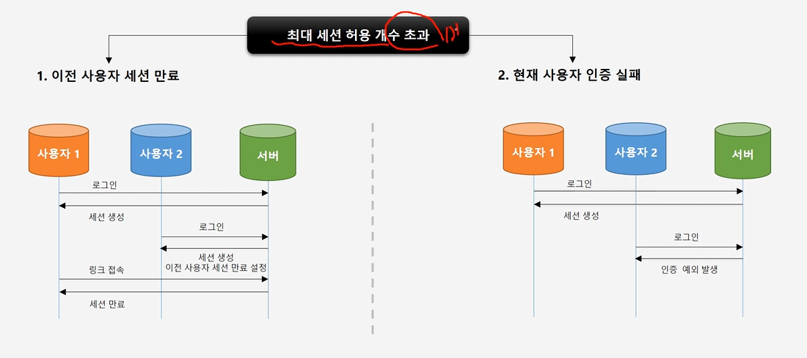
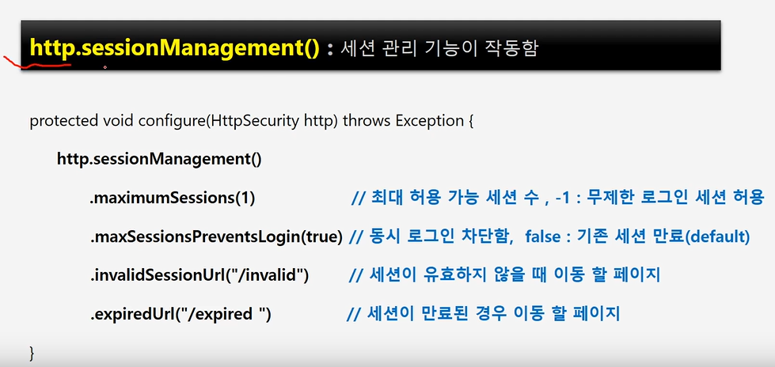
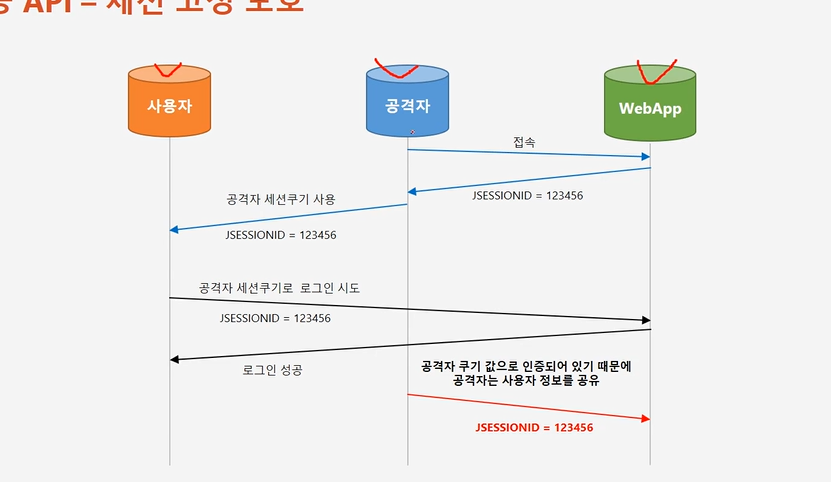
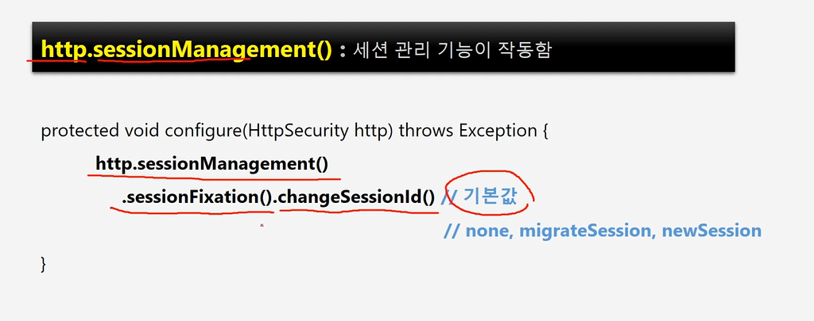

# 동시 세션 제어, 세션 고정 보호 , 세션 정책

- 동시 세션 제어
    - 이전 사용자 세션 만료
    - 현재 사용자 인증 실패 

- 최대 허용 가능 세션수, -1 : 무제한 로그인 세션 허용
- 동시 로그인 차단함 ,  false : 기존 세션 만료 (default)
- 세션이 유효하지 않을 때 이동 할 페이지
- 세션이 만료된 경우 이동 할 페이지

세션 고정 보호

- none , migrateSession , newSession

세션 정책

- SessionCreationPolicy.Always : 스프링 시큐리티가 항상 세션 생성
- SessionCreationPolicy.If Required : 스프링 시큐리티가 필요 시 생성(기본값)
- SessionCreationPolicy.Never : 스프링 시큐리티가 생성하지 않지만 이미 존재하면 사용
- SessionCreationPolicy.Stateless : 스프링 시큐리티가 생성하지 않고 존재해도 사용하지 않음